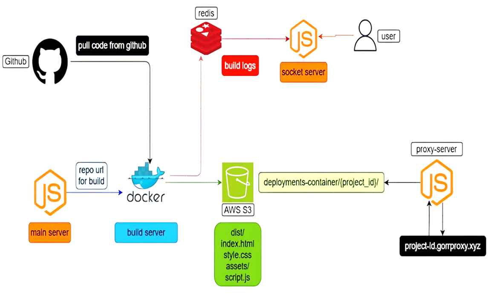

# 🚀 GORR - Microservices-based Deployment Platform

<div align="center">

[](https://nodejs.org)
[](https://expressjs.com)
[](https://socket.io)
[](https://redis.io)
[](https://aws.amazon.com/s3)
[](https://www.docker.com)

GORR is a sophisticated deployment platform built using a microservices architecture, designed to handle project deployments with real-time monitoring and efficient resource management.

[Getting Started](#getting-started) •
[Documentation](#system-architecture) •
[Features](#key-features) •
[Contributing](#contributing)

</div>

---

## 📋 Table of Contents

- [System Architecture](#-system-architecture)
- [Key Features](#-key-features)
- [Technical Stack](#-technical-stack)
- [Environment Setup](#-environment-setup)
- [Getting Started](#-getting-started)
- [Service Ports](#-service-ports)
- [Monitoring](#-monitoring-and-health-checks)
- [Contributing](#-contributing)
- [License](#-license)

## 🏗 System Architecture

<div align="center">
  
</div>

The platform consists of six interconnected servers, each handling specific responsibilities:

### 1. 🎯 Main Server (`main-server/`)

- Primary API server handling authentication, project management, and build requests
- Built with Express.js and Prisma ORM
- Manages user authentication and project metadata
- Handles build requests and project management operations

### 2. 🏭 Build Server (`build-server/`)

- Responsible for building and deploying projects
- Integrates with AWS S3 for artifact storage
- Features real-time build logging through Redis
- Handles dependency installation and build processes
- Supports multiple project types and build configurations

### 3. 🔌 Socket Server (`socket-server/`)

- Manages real-time communication using Socket.IO
- Integrates with Redis for pub/sub messaging
- Provides real-time build logs and deployment status updates
- Handles WebSocket connections for live updates

### 4. 🔄 Proxy Server (`proxy-server/`)

- Reverse proxy server for handling project deployments
- Routes requests to appropriate S3 buckets
- Supports custom domain and subdomain routing
- Handles both regular and Angular-specific routing patterns

### 5. 🏓 Ping-Pong Server (`ping-pong-server/`)

- Health monitoring system for all services
- Tracks uptime and performance metrics
- Provides detailed status information for each service
- Maintains service reliability through regular health checks

### 6. 💻 Client Application (`client/`)

- Frontend interface built with modern web technologies
- Uses Vite as the build tool
- Implements Tailwind CSS for styling
- Features real-time deployment monitoring

## ✨ Key Features

| Feature                 | Description                               |
| ----------------------- | ----------------------------------------- |
| 📊 Real-time Monitoring | Live build and deployment status updates  |
| 🔄 Microservices        | Distributed architecture for scalability  |
| 🔍 Health Checks        | Automated service monitoring and recovery |
| ☁️ AWS Integration      | S3-based artifact storage and deployment  |
| 📡 Real-time Logging    | Redis-powered live log streaming          |
| 🌐 Custom Domains       | Support for custom domains and subdomains |
| 🛡️ Error Handling       | Comprehensive error tracking and logging  |

## 🛠 Technical Stack

<div align="left">

| Category      | Technologies                                                                                                                                                                                            |
| ------------- | ------------------------------------------------------------------------------------------------------------------------------------------------------------------------------------------------------- |
| **Backend**   |   |
| **Frontend**  |                          |
| **Database**  |                                                                                                             |
| **Real-time** |         |
| **Cloud**     |                                                                                                           |
| **Styling**   |                                                                                            |
| **DevOps**    |                                                                                                             |

</div>

## ⚙️ Environment Setup

Each service requires specific environment variables. Create a `.env` file in each service directory:

```env
# Required Environment Variables
REDIS_URL=your_redis_url
S3_ACCESS_KEY=your_s3_access_key
S3_SECRET_ACCESS_KEY=your_s3_secret_key
S3_REGION=your_s3_region
FRONTEND_URL=your_frontend_url

# Optional Environment Variables
LOG_LEVEL=debug
NODE_ENV=development
```

## 🚀 Getting Started

1. **Clone the Repository**

   ```bash
   git clone https://github.com/yourusername/gorr.git
   cd gorr
   ```

2. **Set Up Environment Variables**

   ```bash
   cp .env.example .env
   # Edit .env with your configurations
   ```

3. **Install Dependencies**

   ```bash
   # Install dependencies for all services
   npm run install-all

   # Or install individually
   cd [service-directory]
   npm install
   ```

4. **Start Development Servers**

   ```bash
   # Start all services
   npm run dev

   # Or start individual services
   cd [service-directory]
   npm run dev
   ```

## 🔌 Service Ports

| Service          | Port | Description             |
| ---------------- | ---- | ----------------------- |
| Main Server      | 5000 | API and authentication  |
| Build Server     | ENV  | Build and deployment    |
| Socket Server    | 7000 | Real-time communication |
| Proxy Server     | 8000 | Reverse proxy           |
| Ping-Pong Server | 3001 | Health monitoring       |
| Client           | 5173 | Development server      |

## 📊 Monitoring and Health Checks

The Ping-Pong server provides comprehensive monitoring:

- 📈 Real-time service uptime tracking
- ⏱️ Response time monitoring
- 📊 Resource usage statistics
- 🔍 Service health status

## 🤝 Contributing

We welcome contributions! Here's how you can help:

1. Fork the repository
2. Create your feature branch (`git checkout -b feature/AmazingFeature`)
3. Commit your changes (`git commit -m 'Add some AmazingFeature'`)
4. Push to the branch (`git push origin feature/AmazingFeature`)
5. Open a Pull Request

## 📄 License

This project is proprietary and confidential. All rights reserved.

---

<div align="center">

Made with ❤️ by the GORR Team

</div>
