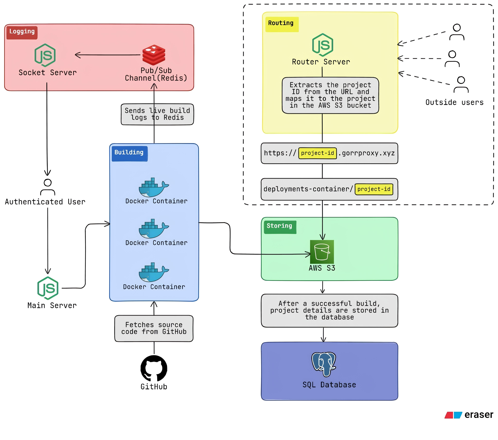

<div style="font-family: Arial, sans-serif;">

<table align="center">
  <tr>
    <td></td>
    <td><h1 style="margin: 0; padding-left: 10px;">GORR</h1></td>
  </tr>
</table>
<!-- #<br> -->
<div align="center"><h2><code>Microservices-based Deployment Platform</code></h2></div>
<br>

<div align="center">

[](https://nodejs.org)
[](https://expressjs.com/)
[](https://reactjs.org/)
[](https://socket.io/)
[](https://www.postgresql.org/)
[](https://www.prisma.io/)
[](https://redis.io/)
[](https://aws.amazon.com/s3/)
[](https://vitejs.dev/)
[](https://tailwindcss.com/)
[](https://www.docker.com/)
[](https://github.com/)

</div>

---

## 🌟 Overview

**GORR** is a sophisticated microservices-based deployment platform designed to streamline project deployments with real-time monitoring, efficient resource management, and seamless integration with cloud services. Built for modern development workflows, GORR provides a comprehensive solution for deploying, monitoring, and managing applications at scale.

> **🎯 Mission**: Simplify deployments, enhance monitoring, and accelerate development workflows through intelligent microservices architecture.

---

## ✨ Key Features

<table>
<tr>
<td width="50%">

### 🚀 **Deployment Excellence**
- **Real-time Monitoring** — Live build and deployment status updates
- **Multi-Project Support** — Handle multiple project types and configurations

</td>
<td width="50%">

### 📊 **Advanced Monitoring**
- **Live Logging** — Redis-powered real-time log streaming
- **WebSocket Communication** — Instant status updates via Socket.IO

</td>
</tr>
<tr>
  <td width="50%">

### 🏗️ **Microservices Architecture**
- **5-Service Design** — Clean separation of concerns
- **Distributed Processing** — Horizontal scaling capabilities

</td>
<td width="50%">

### ☁️ **Cloud Integration**
- **AWS S3 Storage** — Scalable artifact storage and deployment
- **Custom Domains** — Support for custom domains and subdomains
- **ECS Integration** — Container orchestration for scalable deployments

</td>
</tr>
</table>

---

## 🏛️ Architecture Overview

<div align="center">

</div>

### 🧱 Microservices Breakdown

| 🎯 Service | 📝 Description | 🔧 Technology |
|------------|-----------------|---------------|
| **🌐 Main Server** | Authentication, project management, and build orchestration | Express.js, Prisma, PostgreSQL |
| **🏭 Build Service** | Project building, AWS S3 integration, and deployment | Node.js, AWS ECS ECR, Redis |
| **🔌 Socket Server** | Real-time communication and live updates | Socket.IO, Redis Pub/Sub |
| **🔄 Router Service** | Project routing and domain management | Express.js, AWS S3 |
| **💻 Client Application** | Interactive deployment dashboard and monitoring interface | React, Vite, TailwindCSS |

---

## 🛠️ Technology Stack

### 🖥️ **Backend Infrastructure**
| Technology | Badge | Purpose |
|------------|-------|---------|
| **Node.js** |  | Runtime Environment |
| **Express.js** |  | Web Framework |
| **Prisma** |  | ORM & Database Client |

### 🗄️ **Database & Storage**
| Technology | Badge | Purpose |
|------------|-------|---------|
| **PostgreSQL** |  | Primary Database |
| **Redis** |  | Pub/Sub Messaging |
| **AWS S3** |  | Artifact Storage |

### 📡 **Real-time Communication**
| Technology | Badge | Purpose |
|------------|-------|---------|
| **Socket.IO** |  | WebSocket Communication |
| **Redis Pub/Sub** |  | Message Broadcasting |

### 🎨 **Frontend**
| Technology | Badge | Purpose |
|------------|-------|---------|
| **React** |  | UI Library |
| **Vite** |  | Build Tool |
| **TailwindCSS** |  | Styling Framework |

### ☁️ **Cloud Services**
| Technology | Badge | Purpose |
|------------|-------|---------|
| **AWS ECS** |  | Container Orchestration |
| **AWS ECR** |  | Container Registry |
| **AWS S3** |  | Object Storage |

---

## 🚀 Quick Start Guide

### 📋 Prerequisites

Ensure you have the following installed:
- **Node.js** (v16 or higher)
- **npm/yarn** (Package manager)
- **Docker** (For Redis & PostgreSQL)
- **AWS Account** (For S3 and ECS services)
- **Git**

### ⚡ Installation Steps

```bash
# 1️⃣ Clone the repository
git clone https://github.com/shivdutt-B/gorr.git
cd gorr

# 2️⃣ Install dependencies for all services
npm run install-all

# Alternative: Install dependencies for each service individually
cd main-server && npm install && cd ../
cd build-service && npm install && cd ../
cd socket-server && npm install && cd ../
cd router-service && npm install && cd ../
cd client && npm install && cd ../

# 3️⃣ Configure environment variables for each service
cp main-server/.env.example main-server/.env
cp build-service/.env.example build-service/.env
cp socket-server/.env.example socket-server/.env
cp router-service/.env.example router-service/.env
cp client/.env.example client/.env
# Edit each .env file with your own configuration

# 4️⃣ Initialize the PostgreSQL database (from main-server)
cd main-server
npx prisma migrate dev
npx prisma generate
cd ../

# 5️⃣ Start all services (see below for individual service startup)
npm run dev
```

### 🔧 Individual Service Startup

```bash
# 🌐 Start the Main Server (Authentication & Project Management)
cd main-server
npm run dev

# 🏭 Start the Build Service (Project Building & Deployment)
cd build-service
npm run dev

# 🔌 Start the Socket Server (Real-time Communication)
cd socket-server
npm run dev

# 🔄 Start the Router Service (Reverse Proxy & Routing)
cd router-service
npm run dev

# 💻 Start the Client Application (Dashboard Interface)
cd client
npm run dev
```

---

## 📁 Project Structure

```
gorr/
├── 🌐 main-server/                         # API & Authentication Service
│   ├── config/                             # aws configurations
│   ├── controllers/                        # Route handlers
│   ├── services/                           # Utils and helpers
│   ├── routes/                             # API endpoints
│   ├── main.js                             # Entry Point
│   ├── prisma/                             # Database schema & migrations
│   └── package.json                        
│
├── 🏭 build-service/                       # Build & Deployment Service
│   ├── main.js                             # Entry Point
│   └── package.json                        
│
├── 🔌 socket-server/                       # Real-time Communication Service
│   ├── utils.js                            # Utility and Helper
│   ├── app.js                              # Entry Point
│   └── package.json                        
│
├── 🔄 router-service/                      # Reverse Proxy Service
│   ├── main.cjs                            # Entry Point
│   └── package.json                         
│
├── 💻 client/                             # React Dashboard
│   ├── src/
│   │   ├── assets/                         # Contains static files
│   │   ├── components/                     # UI Components
│   │   ├── pages/                          # Application Pages
│   │   ├── hooks/                          # Custom React Hooks
│   │   ├── layouts/                        # Combines components
│   │   ├── states/                         # Store states using Recoil
│   │   ├── utils/                          # Helper Functions
│   │   └── App.jsx                         # Entry Point
│   └── package.json                        
│
└── 📄 README.ASSETS/                       # Documentation Assets
    └── gorr-architecture.jpg               # Architecture Diagram

```

---

## 🔌 Service Ports & Configuration

| 🎯 Service | 🚪 Port | 📝 Description | 🔧 Technology |
|------------|---------|----------------|---------------|
| **🌐 Main Server** | `5000` | API and authentication endpoints | Express.js, Prisma |
| **🏭 Build Service** | `ENV` | Build and deployment processing | Node.js, AWS SDK |
| **🔌 Socket Server** | `7000` | Real-time WebSocket communication | Socket.IO, Redis |
| **🔄 Router Service** | `8000` | Reverse proxy and routing | Express.js |
| **💻 Client** | `5173` | Development dashboard interface | React, Vite |

---

## 🤝 Contributing

We welcome contributions to make GORR even better! Here's how you can help:

### 🚀 Getting Started
1. **Fork** the repository
2. **Clone** your fork locally
3. **Create** a feature branch (`git checkout -b feature/amazing-feature`)
4. **Make** your changes
5. **Test** thoroughly
6. **Commit** your changes (`git commit -m 'Add amazing feature'`)
7. **Push** to your branch (`git push origin feature/amazing-feature`)
8. **Open** a Pull Request

<br>
<div align="center">
<h1><code>🐻‍❄️</code></h1>
</div>